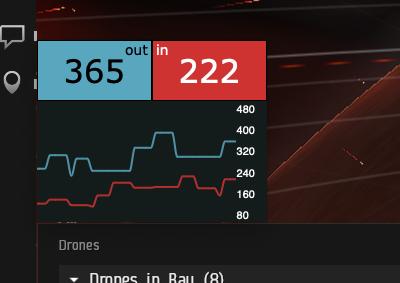

# EVE DPS

> Track incoming and outgoing DPS for EVE Online. Very simple

# Run

- For now, just follow the [neutralino install instructions](https://neutralino.js.org/docs/getting-started/your-first-neutralinojs-app) (eg, `npm install -g @neutralinojs/neu`)
- Clone / download this repo
- Run `neu run`